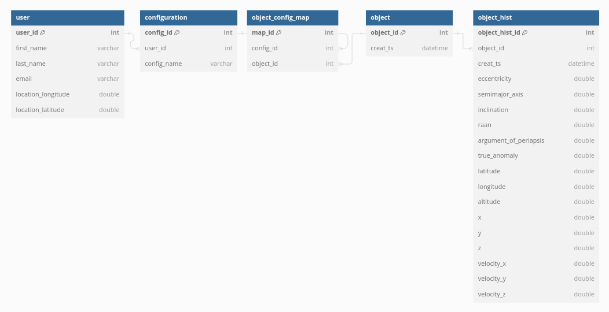

## Setup
Setup and intial execution is handled by the Makefile.
1. `make build`: Builds the docker image. Only needs to be run once.
2. `make up`: Runs the containers for PostGIS, PgAdmin and Digantara (as defined in the Dockerfile).
3. `make down`: Stops the containers

**Note:** The extracted `Assignment data` folder should be present in the same directory.

Secrets have been included in the git repo since it's all dummy data.
- **PosgreSQL DB:** digantara
- **PosgreSQL User:** postgres
- **PosgreSQL Password:** postgis
- **PgAdmin Login:** digantara@postgres.com
- **PgAdmin Password:** postgis

PgAdmin can be accessed at `localhost:8080` to check the tables.

---

## Task 1: Schema Design

Code/Schema for the same can be found in the file `1_init.py`.

## Task 2: SQL Query
Code for this task is available in the file `2_sql_query.py`.

### 1. Pentagon Problem
- Random points selected are stored in the table `task_2_a_input`.
- Input values selected are also printed on the docker compose log.
- All the objects within the pentagon are stored in the table `task_2_a_output`.

### 2. Nearest Point Problem
- Random object selected can be seen in the table `task_2_b_input`.
- Data for the nearest object is stored in the table `task_2_b_output`.

## Task 3: Optimize Database Schema and Query Performance
Multiple practices can be adopted to rectify scalability issues.

1. **Partitioning** can be adopted for horizontal scaling. This would significantly decrease the storage requirements (per node) and speed up queries.\
The effectiveness of this technique has been tested in `3_benchmark.py`.\
\
This code creates a partitioned table called `object_hist_paritioned`. Partition has been created on `creat_ts` at a monthly level.\
Running a simple `SELECT DISTINCT` query for *creat_ts='2022-02-24 04:00:00+00'* takes ~650ms on the unpartitioned table and around ~150ms on the partitioned table.\
The difference is not huge since this was done a fairly small dataset but this adds up significantly while working on bigger tables (2GB+).\
*These numbers were calculated through `EXPLAIN ANALYZE` statement in PostgreSQL.*\
\
Additionally, partitioning can also be done on user data basis their names or basis location/continent.

2. If **Caching** hasn't been setup then something like *redis* can be used for storing frequently accessible data.

3. PostgreSQL automatically sets up **Indexing** for columns with UNIQUE constrains. Indexes can be created for other columns to speed up queries.\
The tradeoff is that disk IO would become slower. (Insert, Update, Delete)

4. Level of data redundancy can also be increased by opting for a more *Denormalized Schema*. This would be costly on storage but could potentially speed up query execution.
